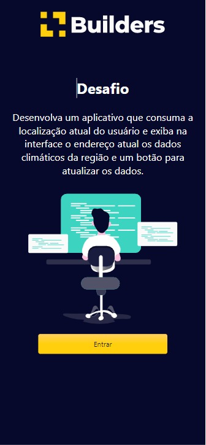
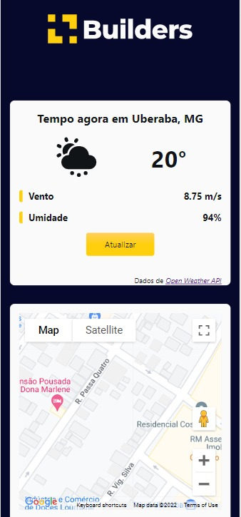
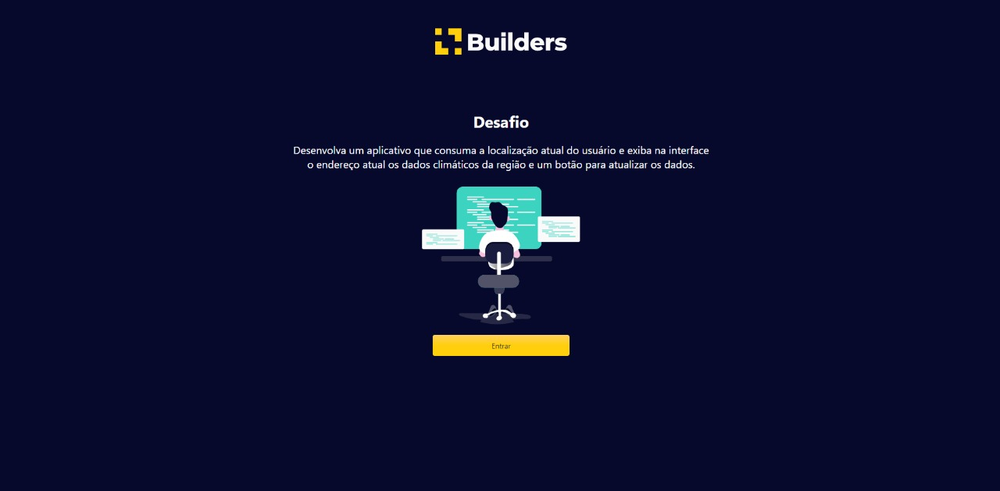
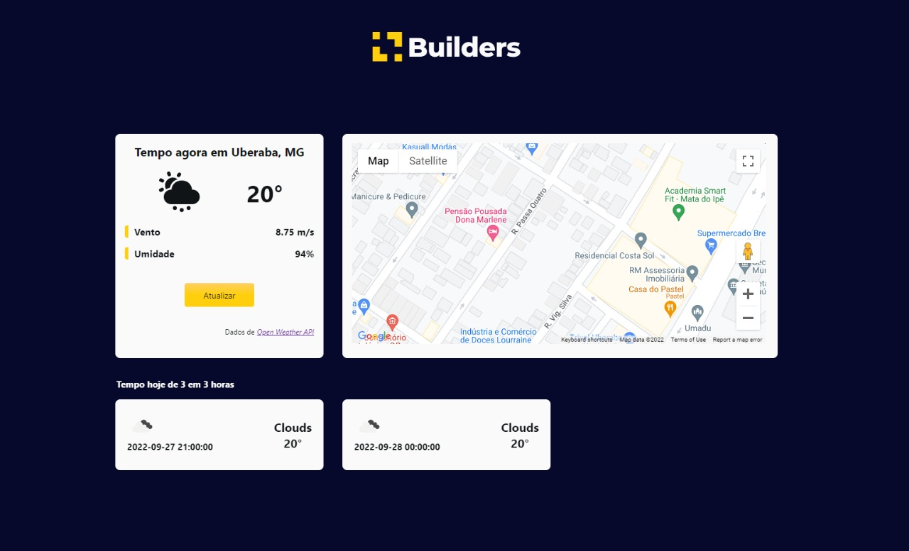

<h1 align="center">
    
</h1>

<h4 align="center">
	🚧 Builders Challenge 🚧
</h4>


# 💻 Sobre o projeto

🚀 Builders Challenge - Desenvolver um aplicativo que consuma a localização atual do usuário e exiba na interface o endereço atual os dados climáticos da região e um botão para atualizar os dados.

- Para fazer essa busca, pode-se usar a API do [Open Weather Map](https://openweathermap.org/api).

O usuário ao entrar na aplicação verá uma página inicial, com a explicaçao do projeto e uma imagem.

Após entrar, o usuário poderá visualizar os dados climáticos da sua região, além de visualizar sua localização no [Google Maps](https://maps.google.com).


Foi realizado o deploy do projeto na [Vercel](https://vercel.com)

👉 **CLIQUE AQUI** [Platform Builders](https://platformbuilders.vercel.app/)

📱 **Foi criado um PWA do sistema também.** 


## 🎨 Layout

O layout da aplicação:

### Mobile

<div style="display: flex; flex-direction: column; justify-content: center; align-items: center;">
  

  

  
</div>

### Web

<div style="display: flex; flex-direction: column; justify-content: center; align-items: center;">
  

  
</div>

## 🛠 Tecnologias

As seguintes ferramentas foram usadas na construção do projeto:
- [NextJs](https://nextjs.org/)
- [React](https://reactjs.org/)
- [TypeScript](typescript)
- [Storybook](https://storybook.js.org/)
- [Jest](https://testing-library.com/)
- [StyledComponents]([styledcomponents](https://styled-components.com/))


## 🚀 Como executar o projeto

### Pré-requisitos

```bash
# Clone este repositório
$ git clone https://github.com/gugagranato/builders

# Acesse a pasta do projeto no terminal/cmd
$ cd builders

# Instale as dependências
$ yarn install

# Execute a aplicação em modo de desenvolvimento
$ yarn dev

# O servidor inciará na porta:3000 - acesse http://localhost:3000
```

##  :warning: IMPORTANTE

Ao abrir o sistema, liberar acesso à localização. 

 - No computador é só liberar na barra de navegação;
 - No iPhone vá em: Ajustes > Localização > Busque pelo aplicativo (Safari, Chrome) > Pedir a próxima vez > Salve.

Após isso, quando entrar novamente, o navegador pedirá acesso à localização.


## 📝 Licença

Este projeto esta sobe a licença MIT.
